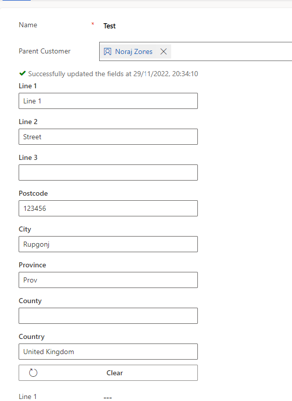
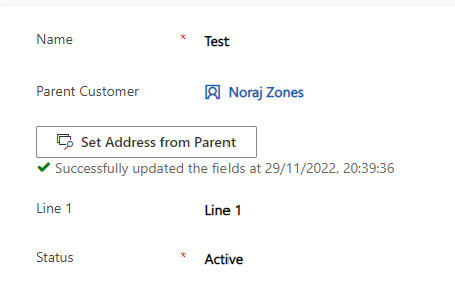
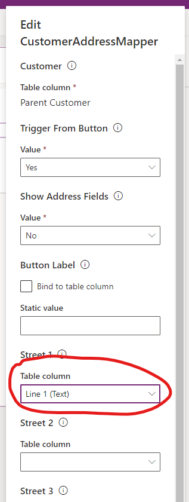

# Codebug Address Mapper

A Power Apps Component Framework Control that retrieves standard address field from a customer field and displays it in the current form. if needed it can be configured so that it can map the address fields in the child entity. 

the funtionality can be triggered from a button within the control or if needed the button can be made invisible in which case the functionality will be triggered on chage of the customer field's value.
### With Custom Address Form

### Without Custom Address Form but with a Button

Currently only these fields are mapped,

 - `address1_line1`
 - `address1_line2`
 - `address1_line3`
 - `address1_city`
 - `address1_county`
 - `address1_country`
 - `address1_postalcode`
 - `address1_stateorprovince` 

## Parameters
| Name | Usage | Default | Comment |
|--|--|--|--|
| Customer | Bound | N/A | Bound to the customer field |
| ShowButton | Shows the trigger button yes/no | Yes | |
| ShowAddressFields | Shows the form for the customer address | No | |
| ButtonLabel | Text on the button | "Get Address from Parent" | Not needed if `ShowButton = No` |
| Street1| Field on the form where `address1_line1` will be mapped | N/A | Leave blank if you do not want to map|
| Street2| Field on the form where `address1_line2` will be mapped | N/A | Leave blank if you do not want to map|
| Street3| Field on the form where `address1_line3` will be mapped | N/A | Leave blank if you do not want to map|
| Postcode| Field on the form where `address1_postalcode` will be mapped | N/A | Leave blank if you do not want to map|
| City| Field on the form where `address1_city` will be mapped | N/A | Leave blank if you do not want to map|
| County| Field on the form where `address1_county` will be mapped | N/A | Leave blank if you do not want to map|
| Province| Field on the form where `address1_stateorprovince` will be mapped | N/A | Leave blank if you do not want to map|
| Country| Field on the form where `address1_country` will be mapped | N/A | Leave blank if you do not want to map|

## Mapping to Form Fields
You can choose to not to show the control's custom button but create your own fields in the child entity and map the address fields in to form like so

